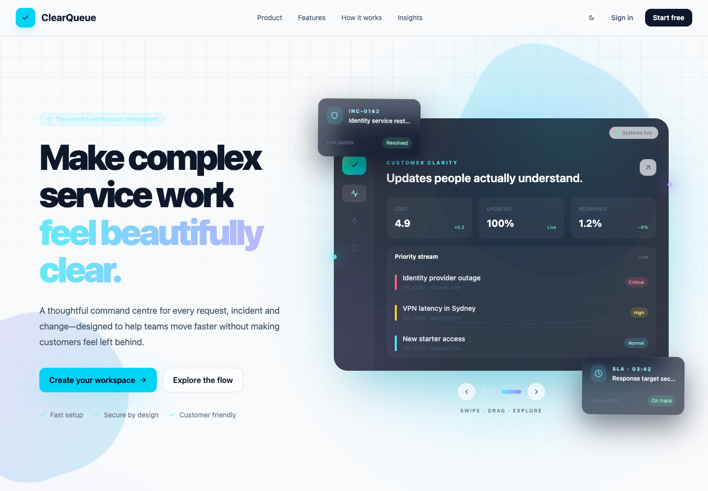
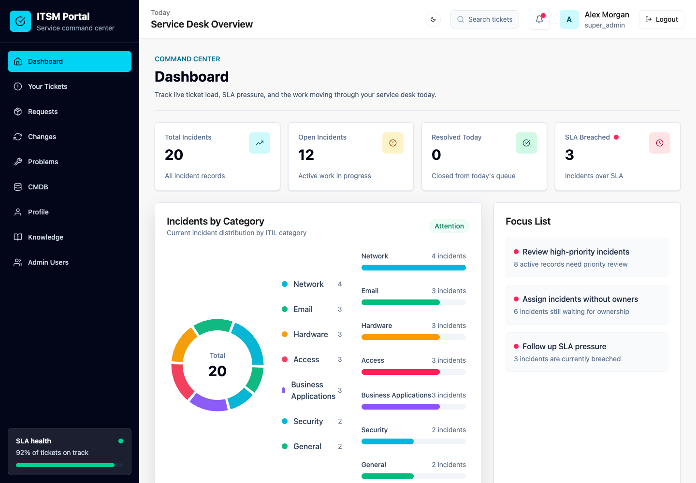
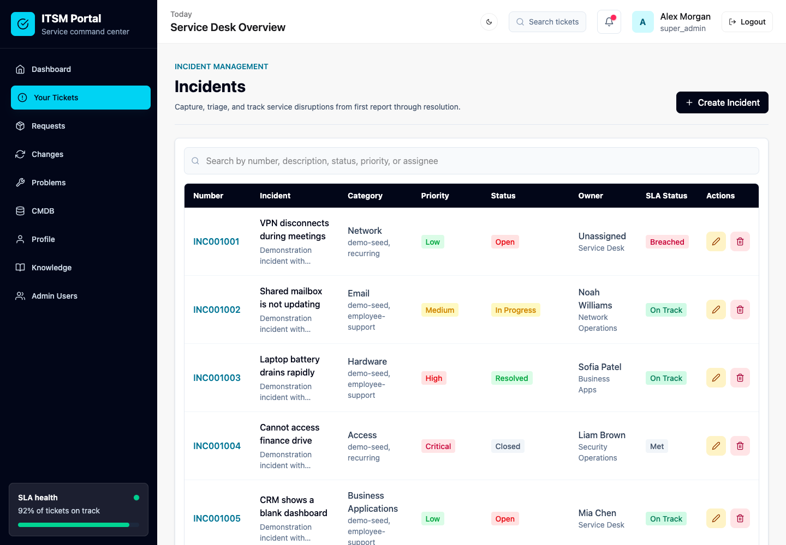

# ClearQueue Ticketing System — Frontend

ClearQueue is a responsive IT service-management frontend for reporting, triaging, assigning, and resolving support work. It provides a public product experience, secure authentication, role-aware dashboards, live incident workflows, service-management modules, SLA visibility, and light/dark themes.

The frontend is built with React 19 and Vite and consumes the versioned ClearQueue REST API.

## Screenshots

### Public landing page



### Service desk dashboard



### Incident management



## Main Features

- Public, responsive product landing page with an animated command-centre hero
- Registration, login, logout, email verification, and password recovery flows
- Short-lived access tokens with automatic refresh-token recovery
- Role-aware experiences for customers, agents, administrators, and super administrators
- Customer dashboard for reporting issues and following ticket progress
- Operational dashboard with live incident, category, priority, assignment, and SLA metrics
- Incident creation, search, editing, deletion, assignment, status, and priority workflows
- Public and internal work-note separation on incident details
- Requests, problems, changes, CMDB, and knowledge-management pages
- Super-admin user role and account-status management
- Profile, password, avatar, attachment, toast, empty-state, and loading-state UX
- Persistent light and dark themes with reduced-motion support

## Roles and Access

| Role | Access |
| --- | --- |
| `user` | Reports incidents, views owned tickets and public updates, submits requests, and reads knowledge articles |
| `agent` | Works the service queue, assigns and updates incidents, and adds public or internal work notes |
| `admin` | Agent capabilities plus administrative incident actions such as deletion |
| `super_admin` | Full operational access plus user role and account-status management |

Role restrictions are enforced by the API as well as the route and navigation layers; hiding a control in the frontend is not treated as authorization.

## Technology

- React 19 and React Router
- Vite 8
- Tailwind CSS 4 and DaisyUI 5
- TanStack Query and Axios
- React Hook Form
- Recharts
- Framer Motion
- React Hot Toast and React Icons

## Requirements

- Node.js 20 or newer
- npm 10 or newer
- The [ClearQueue backend](https://github.com/SudanBasnet/Ticketing-System-Backend) running locally

## Local Setup

1. Install dependencies:

   ```bash
   npm install
   ```

2. Create the local environment file:

   ```bash
   cp .env.example .env
   ```

3. Confirm the API base path in `.env`:

   ```env
   VITE_API_URL=/api/v1
   ```

4. Start the development server:

   ```bash
   npm run dev
   ```

5. Open `http://localhost:5173`.

The Vite development proxy currently forwards `/api` requests to `http://127.0.0.1:5052`. Run the backend on port `5052`, or update the proxy target in `vite.config.js` to match your backend.

## Demo Account

After running `npm run seed:demo` in the backend repository:

```txt
Email: alex.morgan@clearqueue.demo
Password: DemoPassword123!
Role: super_admin
```

These credentials belong only to the repeatable local demonstration dataset and must not be used in production.

## Available Scripts

```bash
npm run dev      # Start Vite with hot-module replacement
npm run build    # Create the production bundle
npm run preview  # Preview the production bundle locally
npm run lint     # Run ESLint
```

## Application Routes

| Route | Purpose | Access |
| --- | --- | --- |
| `/` | Public landing page | Public |
| `/login`, `/register` | Authentication | Public |
| `/forgot-password`, `/reset-password` | Account recovery | Public |
| `/app` | Role-aware dashboard | Authenticated |
| `/incidents` | Incident queue and reporting | Authenticated |
| `/incidents/:id` | Incident detail, attachments, and work notes | Authorized incident users |
| `/requests` | Service requests | Authenticated |
| `/changes`, `/problems`, `/cmdb` | IT service operations | Staff |
| `/knowledge` | Knowledge base | Authenticated |
| `/profile` | Account profile and security | Authenticated |
| `/admin/users` | User roles and account status | Super admin |

## Project Structure

```text
src/
├── Auth/                 # Authentication pages and shared auth shell
├── Layouts/              # Authenticated application layout
├── components/
│   ├── Landing/          # Animated landing-page product scene
│   ├── Layout/           # Sidebar and top navigation
│   ├── ServiceManagement/# Shared ITSM module UI
│   └── UI/               # Reusable fields, badges, modals, loaders, and cards
├── context/              # Authentication state and session hydration
├── pages/                # Dashboards, incidents, service modules, and profile
├── routes/               # Public/protected route configuration
├── services/             # API client and domain request helpers
└── utils/                # Shared presentation utilities
```

## Production Check

Run both checks before committing or deploying:

```bash
npm run lint
npm run build
```

The compiled output is written to `dist/`.

## Related Repository

- [ClearQueue Ticketing System Backend](https://github.com/SudanBasnet/Ticketing-System-Backend)
